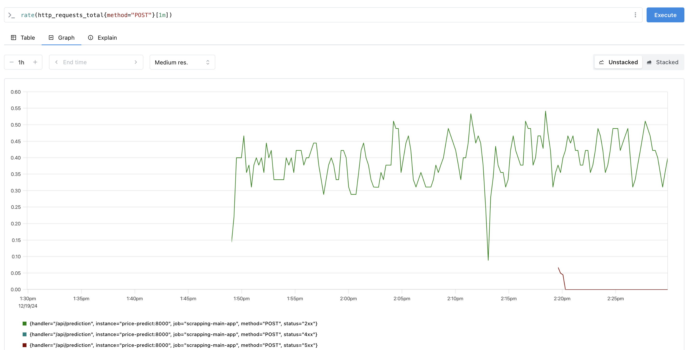
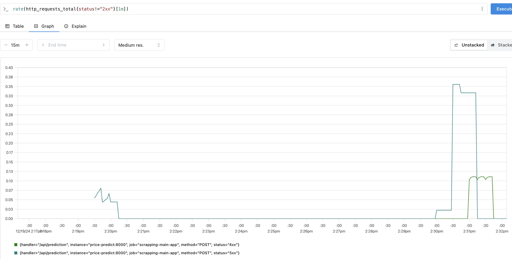
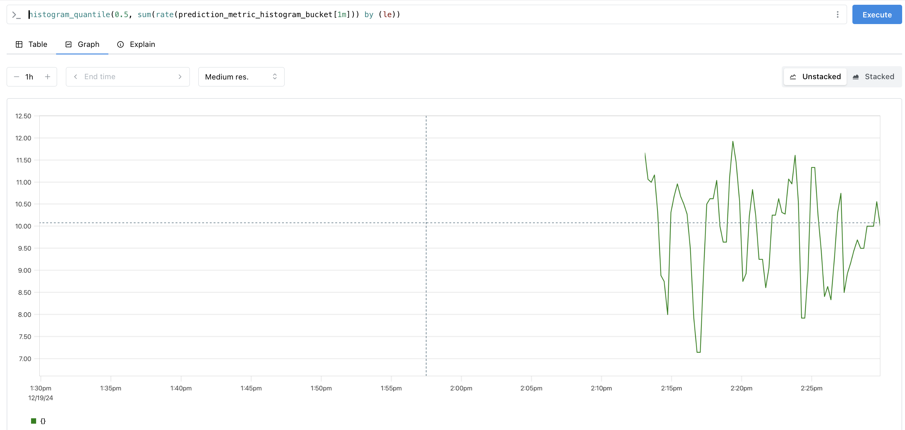
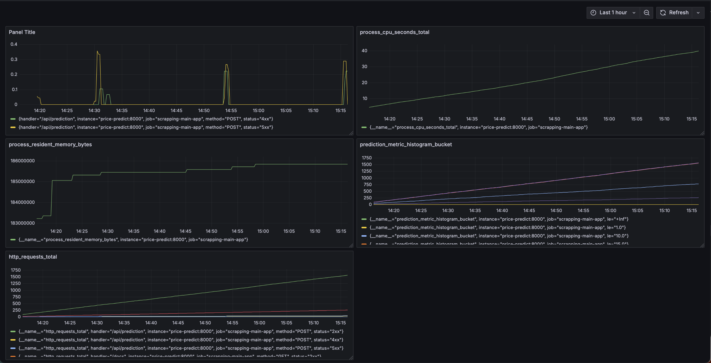

<!-- # Описание проекта
Целью проекта является построение модели для прогнозирования цен на подержанные автомобили. В качестве исходных данных используется набор из Kaggle: [Car Price Prediction Dataset](https://www.kaggle.com/datasets/vijayaadithyanvg/car-price-predictionused-cars/data).

# Запуск
Для запуска проекта выполните следующие команды:

1. Клонируйте репозиторий:
   ```bash
   git clone <https://github.com/Mark-kaz/my_proj>
   cd <repository_folder>

2.	Установите и активируйте виртуальное окружение:
python -m venv .venv_my_proj
source .venv_my_proj/bin/activate  # для MacOS/Linux
.\.venv_my_proj\Scripts\activate   # для Windows

3.	Установите необходимые зависимости:
pip install -r requirements.txt

4.	Запустите MLFlow сервер:
	•	Скрипт находится в корне проекта.
	•	Выполните команду: 
    mlflow server --backend-store-uri sqlite:///mlruns.db --default-artifact-root ./mlruns --host 127.0.0.1 --port 5001

# Результаты исследования
Лучшая модель

По итогам исследования лучшая модель — это Random Forest Regressor. Она была обучена с использованием оптимальных гиперпараметров, подобранных с помощью библиотеки Optuna:
	•	n_estimators: 285
	•	max_depth: 9
	•	max_features: 0.9

Результаты метрик на тестовой выборке:

	•	Mean Absolute Error (MAE): 0.493
	•	Mean Absolute Percentage Error (MAPE): 0.159
	•	Mean Squared Error (MSE): 0.693

# Выбранные признаки

В итоговой модели использовались следующие признаки:
	•	Числовые:
	•	Year
	•	Present_Price
	•	Driven_kms
	•	Категориальные (после обработки OneHotEncoder):
	•	Car_Name
	•	Fuel_Type
	•	Selling_type
	•	Transmission

# Run ID

Модель с лучшими параметрами была залогирована в MLflow. Run ID лучшей модели: 5627ba29c4fd4ae18a98e2b8d085ac00.

Модель зарегистрирована как четвертая версия (v4) с именем: RandomForestModel.

# Запуск MLFlow
Для проверки результатов и экспериментов:
	1.	Запустите сервер MLFlow:
    mlflow server --backend-store-uri sqlite:///mlruns.db --default-artifact-root ./mlruns --host 127.0.0.1 --port 5001
	2.	Откройте интерфейс в браузере:
    http://127.0.0.1:5001
    3.	Найдите нужный эксперимент по имени или идентификатору Run ID.

# Estate Prediction Service

Этот проект предоставляет REST API для предсказания цены объектов на основе входных данных. Сервис разработан с использованием FastAPI и запускается в контейнере Docker.

---

## Структура проекта

### Папка `ml_service`
- `main.py` - Основной файл для запуска приложения FastAPI.
- `api_handler.py` - Класс-обработчик запросов API. Включает логику загрузки модели и предсказания.
- `requirements.txt` - Список зависимостей для работы приложения.

### Папка `models`
- `model.pkl` - Сохраненная машинная модель, используемая для предсказания.

---

## Команды для создания Docker-образа и запуска контейнера Запуск контейнера

### Сборка образа
Для создания Docker-образа выполните команду:

docker build . --tag estate_model:1

## Запуск контейнера
Для запуска контейнера используйте команду:
docker run -p 8001:8000 -v $(pwd)/../models:/models estate_model:1

# Проверка работоспособности сервиса

После запуска контейнера сервис доступен по адресу:
	•	Swagger-документация: http://localhost:8001/docs

Пример тела запроса

Для проверки работы сервиса отправьте POST-запрос на /api/prediction. Пример тела запроса:
{
    "Car_Name": "Honda Activa 4G",
    "Driven_kms": 4300,
    "Fuel_Type": "Petrol",
    "Selling_type": "Individual",
    "Transmission": "Automatic",
    "Owner": 0
}

# Зависимости
Для работы сервиса требуется Python 3.11 и библиотеки из requirements.txt. Все зависимости автоматически устанавливаются при сборке Docker-образа. -->


# Описание проекта

Этот проект представляет собой систему мониторинга и предсказания цен на основе машинного обучения. Система включает несколько сервисов, работающих в Docker контейнерах, для обработки запросов, сбора метрик и мониторинга состояния приложения с использованием Prometheus, Grafana и PostgreSQL.

## Используемые технологии

- **FastAPI**: Веб-фреймворк для Python, который используется для разработки REST API для предсказаний модели.
- **Docker**: Платформа для создания и управления контейнерами.
- **Prometheus**: Система мониторинга и сбора метрик для отслеживания производительности сервисов.
- **Grafana**: Платформа для визуализации метрик и данных из Prometheus.
- **PostgreSQL**: Реляционная база данных для хранения данных.

## Структура проекта

### Сервисы:
1. **price-predict**: Сервис предсказаний, который получает запросы, делает предсказания на основе модели и отправляет результат.
2. **requests**: Сервис для отправки запросов к основному сервису предсказаний.
3. **prometheus**: Сервис для сбора и хранения метрик.
4. **grafana**: Визуализатор данных, который использует метрики, собранные Prometheus.


### Веб-интерфейс:
- **Prometheus**: Доступен по адресу [http://localhost:9090](http://localhost:9090).
- **Grafana**: Доступен по адресу [http://localhost:3000](http://localhost:3000) с логином и паролем `admin:admin`.
- **PgAdmin**: Доступен по адресу [http://localhost:5050](http://localhost:5050).

## Структура файлов
	├── docker-compose.yml
	├── README.md
	├── ml_service/
	│   ├── Dockerfile
	│   ├── main.py
	│   └── api_handler.py
	├── requests/
	│   ├── Dockerfile
	│   ├── req.py
	├── prometheus/
	│   └── prometheus.yml
	├── grafana/
	│   └── Dockerfile
	└── models/
	└── model.pkl

##  Клонируйте репозиторий:
```bash	
   git clone <https://github.com/Mark-kaz/my_proj>
   cd <repository_folder>
```


## Установите и активируйте виртуальное окружение:
```bash	
	python -m venv .venv_my_proj
	source .venv_my_proj/bin/activate  # для MacOS/Linux
	.\.venv_my_proj\Scripts\activate   # для Windows
```	

## Запуск проекта
Чтобы запустить проект, выполните следующие команды:

 **Запуск Docker Compose**:
   В корне проекта выполните команду:
   ```bash
   docker-compose up --build
   ```
Это создаст и запустит все сервисы, включая:
	•	price-predict
	•	requests
	•	prometheus
	•	grafana

## Скриншоты из раздела “Мониторинг” и “Дашборд”
	
### 1.	Графики из Prometheus:





### 2. График из grafana


1.	График количества запросов с кодами ошибки 4xx и 5xx
Этот график позволяет отслеживать количество ошибок, что важно для анализа стабильности и корректности работы API.
2.	График использования памяти процессом
Этот график необходим для контроля за состоянием системы, чтобы убедиться, что приложение не использует слишком много памяти и не вызывает проблемы с производительностью.
3.	График потребления процессорного времени
Позволяет определить, насколько эффективно используется процессор, и выявить потенциальные проблемы с производительностью, такие как высокий уровень загрузки процессора.
4.	Гистограмма предсказанных значений цен
Используется для оценки качества предсказаний модели, чтобы понять, как результаты распределяются и не присутствует ли сильных отклонений от нормальных значений.
5. 	График общего количества запросов, получаемых приложением
Этот график полезен для мониторинга загрузки сервиса и определения пиковых нагрузок.
